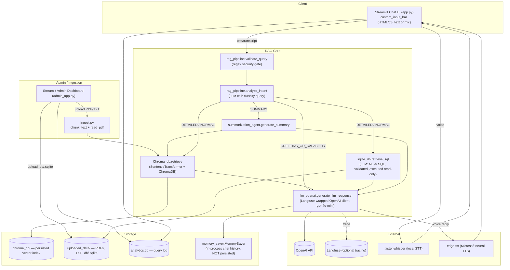

# Conversational AI RAG Chatbot

A voice + text customer-support chatbot built around a hand-rolled Retrieval-Augmented
Generation (RAG) pipeline. It answers questions by retrieving from a local **ChromaDB**
vector store (uploaded PDFs/TXT files) **and** by translating questions into read-only
SQL against uploaded SQLite databases, then asks **OpenAI GPT-4o-mini** to compose an
answer. It ships with a Streamlit chat UI, a separate Streamlit admin dashboard, and a
CLI voice-loop prototype.

> The system prompts in [`rag_pipeline.py`](rag_pipeline.py) are hardcoded for a specific
> use case (UK/Northern Ireland automotive dealer groups: Lookers, Charles Hurst, Sytner
> Group). Everything else in this document describes the generic scaffold underneath
> that content — see [What's Implemented vs. Boilerplate](#whats-implemented-vs-boilerplate--unused-code)
> for what you'd need to change to repurpose it.

---

## Table of Contents

- [Architecture](#architecture)
- [How It Works (Workflow)](#how-it-works-workflow)
- [Project Structure](#project-structure)
- [File-by-File Reference](#file-by-file-reference)
- [Tech Stack](#tech-stack)
- [Setup & Installation](#setup--installation)
- [Running the App](#running-the-app)
- [Running with Docker](#running-with-docker)
- [Environment Variables](#environment-variables)
- [Persistent Data](#persistent-data)
- [What's Implemented vs. Boilerplate / Unused Code](#whats-implemented-vs-boilerplate--unused-code)
- [Known Limitations](#known-limitations)

---

## Architecture



Two independent Streamlit processes make up the "web app":

| Process | File | Default port | Audience |
|---|---|---|---|
| Chat UI | `app.py` | 8501 | End users |
| Admin Dashboard | `admin_app.py` | 8501 (run with `--server.port` override to co-exist with the chat UI) | Internal/admin — upload documents & databases, view analytics |

Plus one non-containerized prototype:

| Process | File | Notes |
|---|---|---|
| CLI voice loop | `main.py` | Press Enter to record via mic (`sounddevice`), transcribes, runs the same RAG pipeline, speaks the answer back via local speakers (`pygame`). Requires a real audio device — run on a host machine, not in Docker. |

## How It Works (Workflow)

### 1. Chat request (`app.py` → `rag_pipeline.generate_response`)

1. **Input** — the custom component in [`custom_input_bar/index.html`](custom_input_bar/index.html)
   captures either typed text or a mic recording (base64-encoded webm) and returns it to
   Streamlit.
2. **Transcription** (voice only) — [`stt.py`](stt.py) transcribes the recording with a
   local `faster-whisper` "base" model (CPU, int8).
3. **Security gate** — [`rag_pipeline.validate_query`](rag_pipeline.py) regex-matches the
   query against a list of destructive/prompt-injection patterns (`DROP TABLE`, "ignore
   previous instructions", etc.) and short-circuits with a canned refusal if matched.
4. **Intent classification** — one LLM call (`analyze_intent`) buckets the query into
   `GREETING_OR_CAPABILITY`, `SUMMARY`, `DETAILED`, or `NORMAL`.
5. **Branch:**
   - `GREETING_OR_CAPABILITY` → answered directly from conversation memory, no retrieval.
   - `SUMMARY` → [`summarization_agent.generate_summary`](summarization_agent.py) pulls
     the top 10 Chroma chunks for the topic and asks the LLM for one summary (no chat
     memory used).
   - `DETAILED` / `NORMAL` → full RAG: retrieves top-7 chunks from ChromaDB **and**
     runs the text-to-SQL flow against any uploaded databases, concatenates both as
     context, and asks the LLM to answer using only that context.
6. **Response** — appended to the in-memory `MemorySaver` history, returned to the UI
   along with a list of source filenames. If the input was voice, the reply is also
   synthesized to speech via `edge-tts` and autoplayed.
7. **Analytics** — every text/voice turn is logged to `analytics.db` (query, response,
   whether it looks "answered", latency).

### 2. Text-to-SQL retrieval (`sqlite_db.py`)

1. `extract_schemas()` opens every `.db`/`.sqlite` file in `uploaded_data/` **read-only**
   (`?mode=ro`) and dumps their `CREATE TABLE` statements.
2. `generate_sql()` asks the LLM to translate the user's question into a single SQLite
   `SELECT` statement scoped to those schemas (aliased `db_0`, `db_1`, ...).
3. `validate_sql()` defense-in-depth checks: query must start with `SELECT`, must not
   contain any of a blocked-keyword list (`DROP`, `DELETE`, `INSERT`, `PRAGMA`, `ATTACH`,
   `;`, `--`, `/*`, etc.), and must not smuggle a second statement past a string literal.
4. `execute_sql()` opens a throwaway in-memory SQLite connection, `ATTACH`es every
   uploaded database read-only, and runs the validated query.

### 3. Document ingestion (`ingest.py` + `Chroma_db.py`)

1. Admin uploads a PDF/TXT via `admin_app.py` → saved to `uploaded_data/`.
2. `ingest_file()` reads the text (`PyPDF2` for PDF, plain read for TXT) and splits it
   into overlapping chunks (`CHUNK_SIZE=1000`, `CHUNK_OVERLAP=100` characters).
3. `Chroma_db.add_documents()` embeds each chunk with a local `SentenceTransformer
   ("all-MiniLM-L6-v2")` model and `upsert`s into the `docs` collection of a
   `chromadb.PersistentClient` backed by `chroma_db/` on disk. Chunk IDs are an
   md5 hash of the chunk content prefixed with the filename, so re-ingesting identical
   content is idempotent.
4. Deleting a document from the admin dashboard calls
   `delete_documents_by_source()`, which removes all chunks with that `source` metadata.

### 4. Observability

Every LLM call goes through `llm_openai.generate_llm_response`, which uses
`langfuse.openai.OpenAI` — a drop-in replacement for the OpenAI SDK client that
automatically traces each call to Langfuse (if `LANGFUSE_*` env vars are configured),
tagged with a `trace_name`, session ID, and `["customer-support"]` tags where applicable.

## Project Structure

```
.
├── app.py                    # Primary Streamlit chat UI (entry point)
├── admin_app.py               # Streamlit admin dashboard (separate process)
├── main.py                    # CLI voice-loop prototype (not container-friendly)
├── rag_pipeline.py             # Core orchestration: security gate, intent routing, prompting
├── Chroma_db.py                # ChromaDB vector store wrapper
├── llm_openai.py                # OpenAI chat completion wrapper (Langfuse-traced)
├── sqlite_db.py                 # Natural-language-to-SQL retrieval over uploaded DBs
├── ingest.py                    # PDF/TXT chunking + ingestion into Chroma
├── summarization_agent.py        # Topic summarization over Chroma content
├── memory_saver.py               # In-memory (non-persistent) chat history
├── analytics_db.py                # SQLite-backed query analytics
├── stt.py                          # Speech-to-text (faster-whisper)
├── tts_service.py                   # Text-to-speech (edge-tts) + local playback (pygame)
├── input_recoder.py                  # CLI microphone capture (sounddevice)
├── vad.py                             # UNUSED — Silero voice-activity detection, not wired in
├── setup_sqlite.py                     # UNUSED — standalone demo script, not part of the app
├── custom_input_bar/
│   └── index.html                      # Custom Streamlit component: text input + mic recorder
├── audio_history/                      # Runtime-generated voice input/output files
├── uploaded_data/                      # Runtime: admin-uploaded PDFs/TXT/SQLite DBs
├── chroma_db/                          # Runtime: persisted Chroma vector index
├── analytics.db                        # Runtime: SQLite analytics log
├── requirements.txt
├── .env.example
├── Dockerfile
├── .dockerignore
└── SKILL.md                            # Unrelated: a Claude-Code agent skill definition, not app docs
```

## File-by-File Reference

| File | Role |
|---|---|
| [`app.py`](app.py) | Streamlit chat UI: renders history, wires the custom input component, calls `generate_response`, logs analytics, plays synthesized audio replies. |
| [`admin_app.py`](admin_app.py) | Separate Streamlit app: KPI/analytics charts (Plotly), document upload → `ingest_file`, SQLite DB upload, per-query latency table. |
| [`main.py`](main.py) | CLI loop: record → `stt.transcribe` → `generate_response` → `tts_to_file` → `play_audio`. Duplicate of `app.py`'s flow for a terminal/local-speaker environment. |
| [`rag_pipeline.py`](rag_pipeline.py) | `validate_query` (regex security gate), `analyze_intent` (LLM classification), `generate_response` (branches to greeting/summary/RAG, builds prompts, calls the LLM, updates memory). Contains the hardcoded automotive-dealer domain prompts. |
| [`Chroma_db.py`](Chroma_db.py) | `add_documents`, `delete_documents_by_source`, `retrieve`, `reset_db` — all vector-store operations against a local persistent ChromaDB collection named `docs`. |
| [`llm_openai.py`](llm_openai.py) | Thin wrapper around `langfuse.openai.OpenAI().chat.completions.create(...)`, model `gpt-4o-mini`, temperature `0.3`. Raises at import time if `OPENAI_API_KEY` is unset. |
| [`sqlite_db.py`](sqlite_db.py) | `extract_schemas`, `generate_sql`, `validate_sql`, `execute_sql`, `retrieve_sql` — the NL→SQL retrieval path described above. |
| [`ingest.py`](ingest.py) | `chunk_text`, `read_pdf`, `ingest_file`. Also has a `--reset` CLI flag that wipes the Chroma collection — but no CLI flag to actually ingest a file path (see [below](#whats-implemented-vs-boilerplate--unused-code)). |
| [`summarization_agent.py`](summarization_agent.py) | `generate_summary`: pulls top-10 Chroma chunks for a topic and asks the LLM for a single structured summary. |
| [`memory_saver.py`](memory_saver.py) | 12-line `MemorySaver` class: an in-process list of `{role, content}` turns. No persistence — lost on process restart. |
| [`analytics_db.py`](analytics_db.py) | `init_analytics_db`, `log_query`, `get_analytics`, `get_recent_queries` — a small SQLite table (`queries`) tracking every chat turn. |
| [`stt.py`](stt.py) | Loads a `faster-whisper` `"base"` model once at import (CPU, int8) and exposes `transcribe(audio_path)`. |
| [`tts_service.py`](tts_service.py) | `tts_to_file` (async, `edge-tts`, voice `en-US-AriaNeural`) and `play_audio` (`pygame.mixer`, local speaker playback — CLI only). `pygame.mixer.init()` runs at import time (see [Known Limitations](#known-limitations)). |
| [`input_recoder.py`](input_recoder.py) | `record_audio_manual`: blocking press-Enter-to-start/stop mic capture via `sounddevice`. Used only by `main.py`. |
| [`vad.py`](vad.py) | **Unused.** Silero VAD wrapper (`detect_speech`) — not imported anywhere in the codebase. |
| [`setup_sqlite.py`](setup_sqlite.py) | **Unused.** Standalone script that creates a `knowledge.db` with 5 hardcoded sample rows at the project root — not wired into the app and not even placed in `uploaded_data/` where `sqlite_db.py` looks for databases. |
| [`custom_input_bar/index.html`](custom_input_bar/index.html) | Vanilla JS/HTML Streamlit custom component providing the chat input bar with an inline mic-record button; communicates back to Streamlit via `Streamlit.setComponentValue`. |

## Tech Stack

| Concern | Choice |
|---|---|
| Web UI | Streamlit |
| Vector database | ChromaDB (local, on-disk, `PersistentClient`) |
| Embeddings | `sentence-transformers` — `all-MiniLM-L6-v2` (local, no API calls) |
| LLM | OpenAI `gpt-4o-mini` via the `openai` SDK, wrapped by `langfuse.openai` |
| LLM tracing | Langfuse (optional) |
| Structured data retrieval | SQLite, natural-language-to-SQL via the same LLM, with a validated read-only execution layer |
| Speech-to-text | `faster-whisper` (local, CPU, `base` model) |
| Text-to-speech | `edge-tts` (Microsoft Edge neural voices, no API key required) |
| Analytics | SQLite (`analytics.db`) + Plotly charts in the admin dashboard |
| Orchestration framework | **None** — this is a hand-rolled pipeline; no LangChain/LlamaIndex |

## Setup & Installation

### Prerequisites

- Python 3.10 (the codebase was developed/tested on 3.10; see [Docker](#running-with-docker) for a pinned environment)
- An OpenAI API key
- (Windows/macOS/Linux) a working microphone + speakers only if you intend to use voice mode locally

### Local install

```bash
python -m venv .venv
# Windows: .venv\Scripts\activate | macOS/Linux: source .venv/bin/activate

# CPU-only torch first (optional but recommended — see requirements.txt comment)
pip install torch --index-url https://download.pytorch.org/whl/cpu

pip install -r requirements.txt

cp .env.example .env   # then fill in OPENAI_API_KEY (and Langfuse keys if desired)
```

## Running the App

```bash
# Primary chat UI — http://localhost:8501
streamlit run app.py

# Admin dashboard — run on a different port so it can coexist with app.py
streamlit run admin_app.py --server.port 8502

# CLI voice-loop prototype (requires a local mic/speaker; not for containers)
python main.py
```

Use the admin dashboard's **RAG Documents** page to upload PDFs/TXT (ingested into
ChromaDB) and its **SQL Databases** page to upload `.db`/`.sqlite` files that the
text-to-SQL layer will query against.

## Running with Docker

```bash
docker build -t rag-agent .

docker run -d \
  --name rag-agent \
  -p 8501:8501 \
  --env-file .env \
  -v rag-agent-chroma:/app/chroma_db \
  -v rag-agent-uploads:/app/uploaded_data \
  -v rag-agent-analytics:/app/analytics.db \
  rag-agent
```

Then open `http://localhost:8501`.

To also run the admin dashboard from the same image, in a second container on a
different published port:

```bash
docker run -d \
  --name rag-agent-admin \
  -p 8502:8502 \
  --env-file .env \
  -v rag-agent-chroma:/app/chroma_db \
  -v rag-agent-uploads:/app/uploaded_data \
  -v rag-agent-analytics:/app/analytics.db \
  rag-agent \
  streamlit run admin_app.py --server.port=8502 --server.address=0.0.0.0
```

> Mount the **same** volumes for both containers — the chat UI and admin dashboard read
> and write the same `chroma_db/`, `uploaded_data/`, and `analytics.db`.

`main.py` (the CLI voice loop) is intentionally not exposed via the Dockerfile's `CMD` —
it requires a real audio input/output device attached to the process, which containers
generally don't have. Run it directly on a host machine instead.

## Environment Variables

See [`.env.example`](.env.example).

| Variable | Required | Used by | Notes |
|---|---|---|---|
| `OPENAI_API_KEY` | **Yes** | `llm_openai.py` | Raises `ValueError` at import time (i.e. app fails to start) if missing. |
| `LANGFUSE_PUBLIC_KEY` | No | `llm_openai.py` (via `langfuse.openai.OpenAI`) | Enables LLM call tracing. |
| `LANGFUSE_SECRET_KEY` | No | same | |
| `LANGFUSE_HOST` | No | same | Defaults to Langfuse Cloud if unset. |

## Persistent Data

| Path | Contents | Persistence |
|---|---|---|
| `chroma_db/` | Vector index for ingested documents | Must persist — mount as a volume |
| `uploaded_data/` | Raw uploaded PDFs/TXT/SQLite DBs | Must persist — mount as a volume |
| `analytics.db` | Query analytics log | Must persist — mount as a volume/file |
| `audio_history/` | Per-turn voice input/output audio files | Ephemeral/cache — grows unbounded, nothing currently prunes it (see [Known Limitations](#known-limitations)) |

## What's Implemented vs. Boilerplate / Unused Code

This project has a few areas that are either dead code, incomplete scaffolding, or
demo/placeholder-grade — worth knowing before you build on top of it:

- **`vad.py` is completely unused.** It defines Silero voice-activity detection
  (`detect_speech`) but is never imported anywhere. It also pulls in `torch.hub` at
  *import* time (a network call to download the Silero model), so simply importing this
  file today would be slow/fragile — another reason it's correctly left disconnected.
  It is **not** included in `requirements.txt`'s installed feature set beyond what
  `sentence-transformers` already needs.
- **`setup_sqlite.py` is a disconnected demo script.** It creates a `knowledge.db` with
  5 hardcoded sample rows (company policy, holidays, etc.) at the project root. It's
  never imported by any other module, and even if run, its output file lands in the
  wrong directory to be picked up by `sqlite_db.get_sql_files()` (which only scans
  `uploaded_data/`). Treat it as leftover example code, not a setup step.
- **`ingest.py`'s CLI is incomplete.** `python ingest.py --reset` clears the Chroma
  collection, but there is no CLI argument to ingest a specific file — `ingest_file()`
  is only ever called from `admin_app.py`'s upload handler. If you need to bulk-ingest
  files outside the admin UI, you'd need to add that argument yourself.
- **Chat memory is in-process and non-persistent.** `memory_saver.MemorySaver` is a
  12-line in-memory list. It's per-Streamlit-session (`st.session_state.memory_saver`)
  or per-CLI-run, and is lost entirely on process restart or container recycle. There is
  no database-backed conversation history.
- **The domain content is hardcoded, not configurable.** All three system prompts in
  `rag_pipeline.py` (`GREETING_OR_CAPABILITY`, `DETAILED`, `NORMAL`) hardcode "the
  automotive dealer groups Lookers, Charles Hurst, and Sytner Group." To repurpose this
  for a different domain, you'd edit those three prompt strings directly — there's no
  config file or environment variable driving them.
- **`main.py` and `app.py` are parallel, duplicate implementations** of the same
  record → transcribe → RAG → speak loop — one for a terminal + local speakers, one for
  the browser. Changes to the RAG flow itself only need to happen once (`rag_pipeline.py`
  is shared), but UI/UX changes have to be made in both places if you want parity.
- **Two independent, non-integrated "structured data" approaches exist**:
  `setup_sqlite.py` (unused demo) and `sqlite_db.py` (the real, wired-in NL→SQL path).
  Only the latter is live.
- **Langfuse trace labeling is inconsistent.** Calls from `rag_pipeline.py` pass
  `trace_name`/`session_id`/`tags`; calls from `sqlite_db.generate_sql` and
  `summarization_agent.generate_summary` don't, so those traces show up less labeled in
  the Langfuse dashboard. Not a bug, just incomplete observability coverage.

## Known Limitations

- **`tts_service.py` calls `pygame.mixer.init()` at import time**, and `app.py` imports
  `tts_service`. In a headless container with no audio device, this can raise
  `pygame.error: No available audio device` unless an audio driver is forced — the
  provided `Dockerfile` sets `SDL_AUDIODRIVER=dummy` to avoid this.
- `audio_history/` is never cleaned up automatically; every voice turn writes a new
  input/output file that stays on disk indefinitely.
- `app.py` (lines 191/194/267) calls `.replace("\\n", "<br>")`, i.e. it replaces the
  literal two-character sequence `\n` (backslash + n) rather than an actual newline
  character. This rarely triggers in practice since LLM output typically contains real
  newlines, not the escaped form.
- No automated tests exist in the repository.
- No CI configuration (`.github/workflows`) exists.
